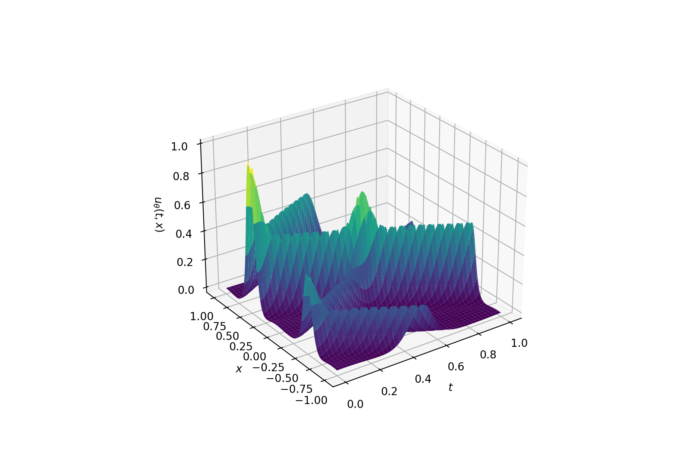
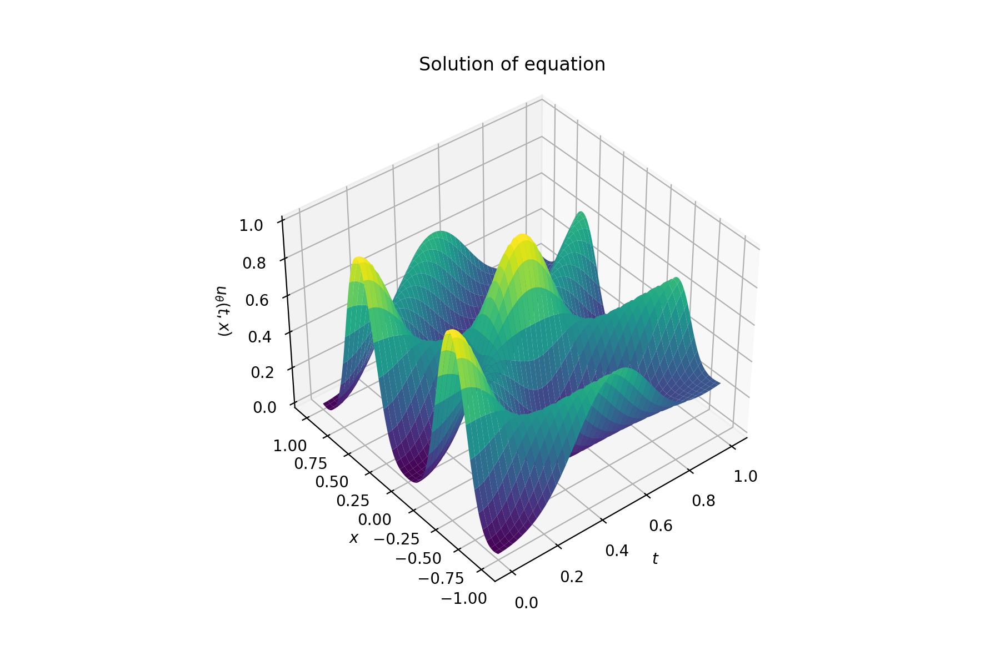
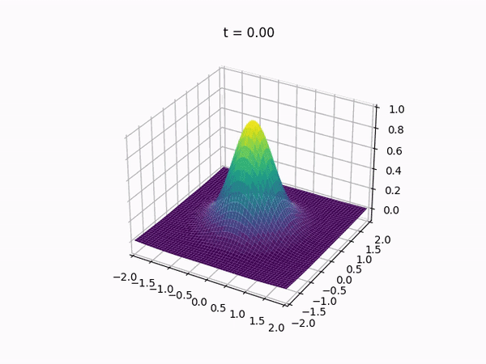
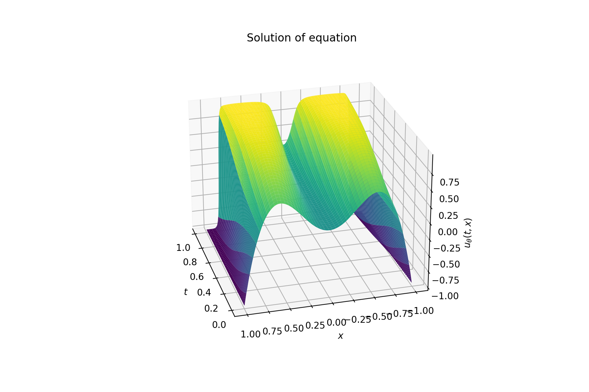
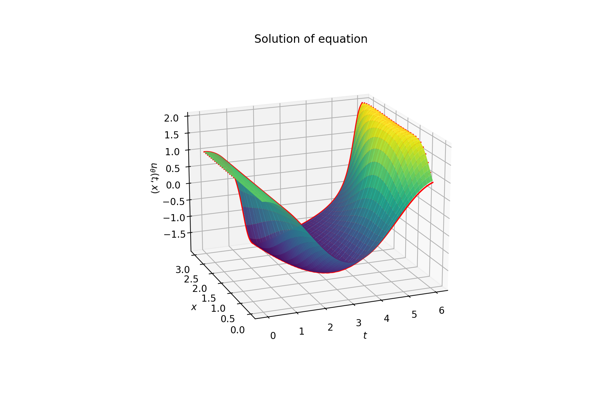
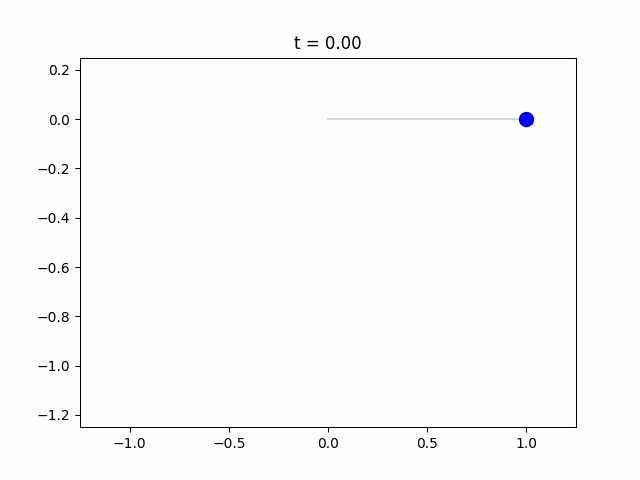

<div id="top"></div>

[![Contributors][contributors-shield]][contributors-url]
[![Forks][forks-shield]][forks-url]
[![Stargazers][stars-shield]][stars-url]
[![Issues][issues-shield]][issues-url]
[![MIT License][license-shield]][license-url]


<!-- PROJECT LOGO -->
<br />
<div align="center">
  <a href="https://github.com/albertemc2stein/PINN">
    
  </a>

  <h3 align="center">PINN</h3>

  <p align="center">
    A framework for solving differential equations with neural networks.
    <br />
    <a href="https://albertemc2stein.github.io/PINN"><strong>Explore the docs »</strong></a>
    <br />
    <br />
    <a href="https://github.com/albertemc2stein/PINN">View Demo</a>
    ·
    <a href="https://github.com/albertemc2stein/PINN/issues">Report Bug</a>
    ·
    <a href="https://github.com/albertemc2stein/PINN/issues">Request Feature</a>
  </p>
</div>


<!-- TABLE OF CONTENTS -->
<details>
  <summary>Table of Contents</summary>
  <ol>
    <li>
      <a href="#about-the-project">About The Project</a>
      <ul>
        <li><a href="#built-with">Built With</a></li>
      </ul>
    </li>
    <li><a href="#usage">Usage</a></li>
    <li><a href="#roadmap">Roadmap</a></li>
    <li><a href="#contributing">Contributing</a></li>
    <li><a href="#license">License</a></li>
    <li><a href="#contact">Contact</a></li>
  </ol>
</details>


<!-- ABOUT THE PROJECT -->
## About The Project

[![PINN Screen Shot][PINN-Screenshot]](https://en.wikipedia.org/wiki/Physics-informed_neural_networks)

This project makes use of the fact that neural networks are essentially nothing more than universal
function approximators. In essence, the neural network is trained upon minimizing a loss function
that measures the deviation from a solution to the given differential equation (and additional constraints).

Basic approach:
* Create a new boundary value problem
* Add constraints and the regions hey are acting on
* Tell the network which differentials it needs to calculate
* Train the network

This is obviously only a very basic description of one of the many ways to utilize this approach.
The many examples provided with this package show the abilities (and limits!) of this framework.

<p align="right">(<a href="#top">back to top</a>)</p>


### Built with
* [TensorFlow](https://www.tensorflow.org/) (Neural network support)
* [NumPy](https://numpy.org/) (Efficient sampling)
* [Matplotlib](https://matplotlib.org/) (Visualization)

<p align="right">(<a href="#top">back to top</a>)</p>


<!-- GETTING STARTED -->
## Getting Started

The `PDESolver` is available as a Python package that can be installed and used with Python 3.7+. This section shows how to compile the PDESolver package from source using [`pip`](https://pypi.org/project/pip/). It is recommended to install the package inside a [virtual environment](https://docs.python.org/3/tutorial/venv.html) when testing.


### Create a Virtual Environment

We are going to use the [`venv`](https://docs.python.org/3/library/venv.html) package for creating a lightweight virtual environment. Create an empty virtualenv with:

```
python -m venv myvenv     (Mac/Linux)
py -m venv myvenv         (Windows)
```

Here, `myvenv` is the name of the virtual environment. You can replace it with any name of your choice with full path, e.g., use `~/Desktop/testing` to create a virtualenv called `testing` in the `Desktop` folder. If the command fails to run, you might need to install the `venv` package itself first using `pip install virtualenv` (Mac/Linux) or `py -m pip install virtualenv` (Windows).

Once the virtual environment is created, activate it with

```
source path/myvenv/bin/activate     (Mac/Linux)
path/myvenv/Scripts/activat         (Windows)
```

where `path` is the path to the venv. Now, you can install and test the `PDESolver` package inside this environment.


### Install the `PDESolver` package

Download the latest source code by directly cloning the repository:

```
git clone https://github.com/AlbertEMC2Stein/PINN
```

and then compile it by running

```
pip install -e .           (Mac/Linux)
py -m pip install -e .     (Windows)
```

from within the cloned directory (`cd PINN`). This would download all the package dependencies which might take a minute. If there is an error locating any of the dependencies, make sure you are using Python 3.7+. You can also try upgrading your `pip` to the latest version by running `pip install --upgrade pip` (Mac/Linux) or `py - m pip install --upgrade pip` (Windows).

The package can now be imported into any Python scripts running inside this virtual environment. See the `scripts/` folder for some examples to get you started.


<p align="right">(<a href="#top">back to top</a>)</p>


<!-- USAGE EXAMPLES -->
## Usage

_For usage examples, please refer to the [provided scripts](https://github.com/AlbertEMC2Stein/PINN/tree/main/scripts)_

### Example results
#### Solutions to the 1D wave equation



#### Solution to the 2D wave equation


#### Solution to the Allen-Cahn equation 


#### Solution to the Van-Der-Pol equation with varying parameter


#### Solution to the simple pendulum DAE


<p align="right">(<a href="#top">back to top</a>)</p>


<!-- ROADMAP -->
## Roadmap

- [x] Add arbitrary dimension support
- [x] Add different sampling methods
- [ ] Add more region types (spherical, cylindrical, etc.)
- [ ] Add better visulization support
    - [ ] 1D
    - [ ] 2D

See the [open issues](https://github.com/albertemc2stein/PINN/issues) for a full list of proposed features (and known issues).

<p align="right">(<a href="#top">back to top</a>)</p>


<!-- CONTRIBUTING -->
## Contributing

If you have a suggestion that would make this better, please fork the repo and create a pull request. You can also simply open an issue with the tag "enhancement".
Don't forget to give the project a star! Thanks again!

1. Fork the Project
2. Create your Feature Branch (`git checkout -b feature/NewFeature`)
3. Commit your Changes (`git commit -m 'Add some NewFeature'`)
4. Push to the Branch (`git push origin feature/NewFeature`)
5. Open a Pull Request

<p align="right">(<a href="#top">back to top</a>)</p>


<!-- LICENSE -->
## License

Distributed under the MIT License. See `LICENSE.txt` for more information.

<p align="right">(<a href="#top">back to top</a>)</p>


<!-- CONTACT -->
## Contact

Tim Prokosch - prokosch@rhrk.uni-kl.de

Project Link: [https://github.com/albertemc2stein/PINN](https://github.com/albertemc2stein/PINN)

<p align="right">(<a href="#top">back to top</a>)</p>


<!-- ACKNOWLEDGMENTS -->
## Acknowledgments

* [Implementation for Burgers equation](https://github.com/janblechschmidt/PDEsByNNs/blob/main/PINN_Solver.ipynb)
* [Paper by Maziar Raissi](https://www.sciencedirect.com/science/article/pii/S0021999118307125)


<p align="right">(<a href="#top">back to top</a>)</p>


<!-- MARKDOWN LINKS & IMAGES -->
<!-- https://www.markdownguide.org/basic-syntax/#reference-style-links -->
[contributors-shield]: https://img.shields.io/github/contributors/albertemc2stein/PINN.svg?style=for-the-badge
[contributors-url]: https://github.com/albertemc2stein/PINN/graphs/contributors
[forks-shield]: https://img.shields.io/github/forks/albertemc2stein/PINN.svg?style=for-the-badge
[forks-url]: https://github.com/albertemc2stein/PINN/network/members
[stars-shield]: https://img.shields.io/github/stars/albertemc2stein/PINN.svg?style=for-the-badge
[stars-url]: https://github.com/albertemc2stein/PINN/stargazers
[issues-shield]: https://img.shields.io/github/issues/albertemc2stein/PINN.svg?style=for-the-badge
[issues-url]: https://github.com/albertemc2stein/PINN/issues
[license-shield]: https://img.shields.io/github/license/albertemc2stein/PINN.svg?style=for-the-badge
[license-url]: https://github.com/albertemc2stein/PINN/blob/master/LICENSE.txt
[PINN-screenshot]: https://media.springernature.com/relative-r300-703_m1050/springer-static/image/art%3A10.1038%2Fs42254-021-00314-5/MediaObjects/42254_2021_314_Figc_HTML.png
